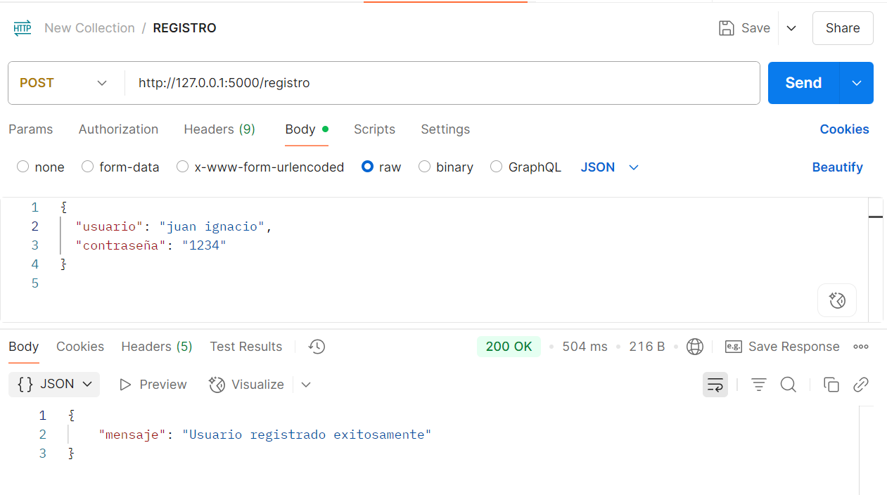
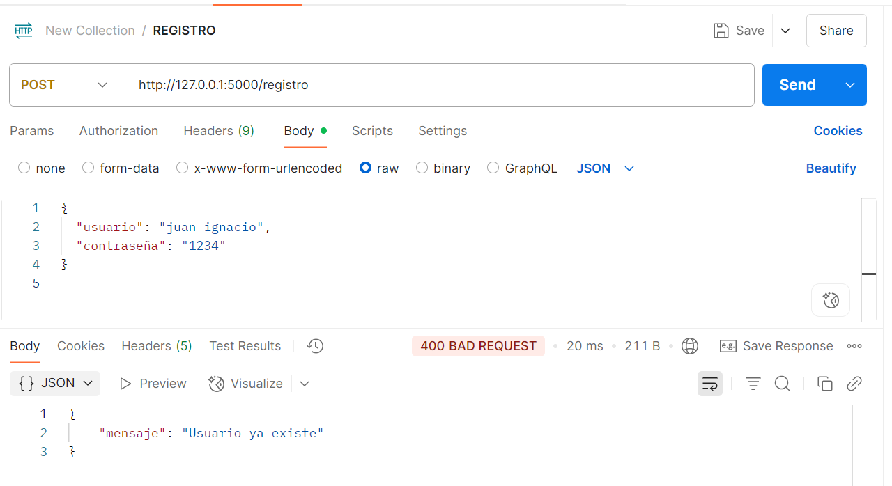
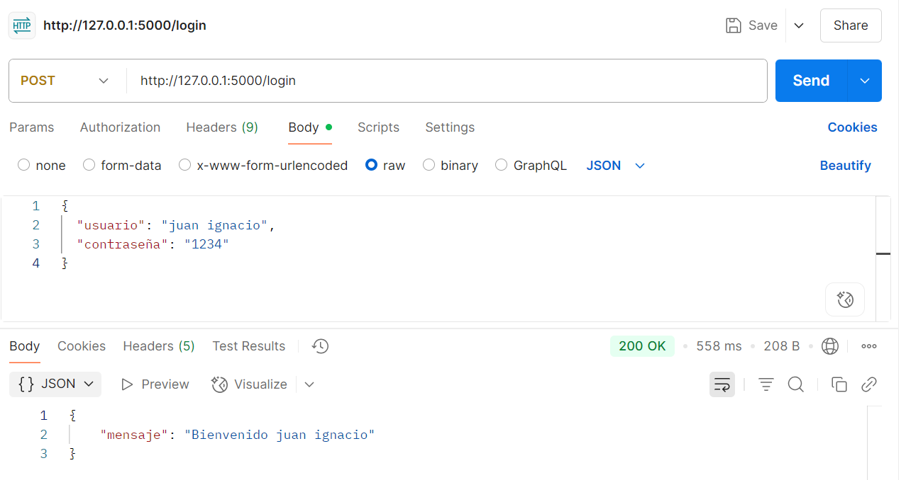
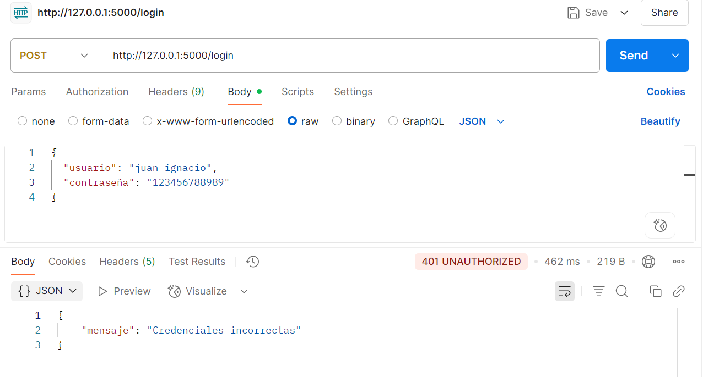
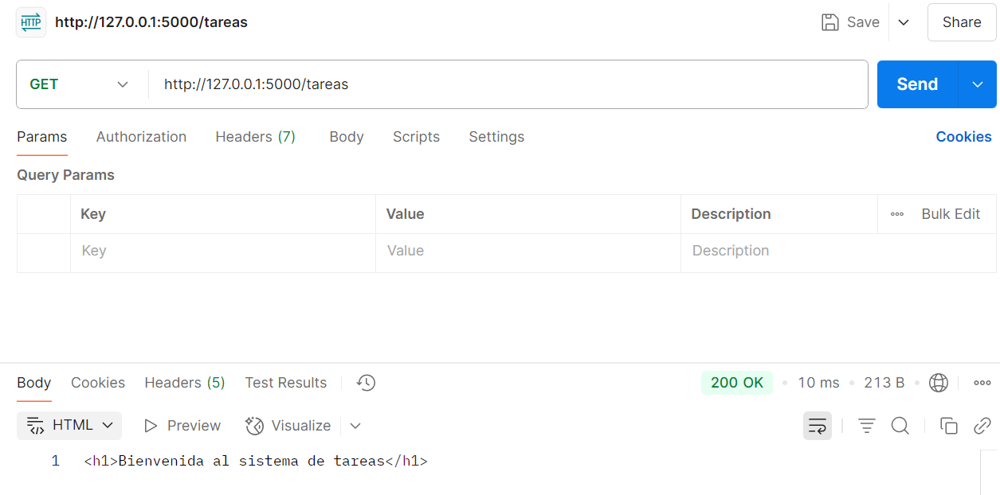

# PFO 2: Sistema de Gestión de Tareas con API y Base de Datos

Github page: https://iriszamora.github.io/pfo2-programacionsobreredes/

## Instrucciones para ejecutar el proyecto

1. Clonar el repositorio:

git clone https://github.com/IrisZamora/pfo2-programacionsobreredes.git
cd pfo2-programacionsobreredes

2. Crear entorno virtual:

python -m venv venv

3. Activar entorno:

venv\Scripts\activate

4. Instalar dependencias: 

pip install flask flask-bcrypt flask-sqlalchemy

5. Ejecutar API: 

python servidor.py

El servidor se ejecutará en: http://127.0.0.1:5000

### Endpoints y pruebas

Endpoints disponibles:

- POST /registro: Registra un nuevo usuario.

- POST /login: Inicia sesión.

- GET /tareas: Página de bienvenida a tareas.

Pruebas:

✅POST: http://127.0.0.1:5000/registro

Registro exitoso:

Intento de registrar usuario existente:

✅POST: http://127.0.0.1:5000/login

Login Exitoso:

Login fallido:

✅GET: http://127.0.0.1:5000/tareas

Página de tareas:

#### Respuestas conceptuales

- ¿Por qué hashear contraseñas?

Porque guardar contraseñas en texto plano es un riesgo de seguridad. Si alguien accede a la base de datos, las podría ver. Hashearlas significa que se guarda una versión encriptada que no se puede revertir fácilmente.

- Ventajas de usar SQLite en este:

SQLite es una base de datos ligera, sin necesidad de servidor, ideal para proyectos chicos. Facilita pruebas y despliegue rápido sin configuraciones complejas. Además es fácil de integrar con Flask.

